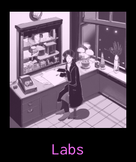
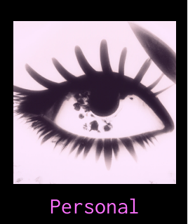
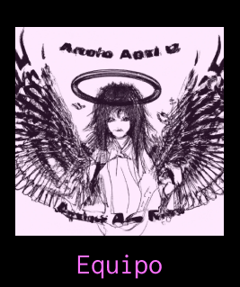

<!DOCTYPE html>
<html lang="en">
<head>
    <meta charset="UTF-8">
    <meta http-equiv="X-UA-Compatible" content="IE=edge">
    <meta name="viewport" content="width=device-width, initial-scale=1.0">
    <title>Nuria González - Portafolio</title>
    <link rel="preconnect" href="https://fonts.googleapis.com">
<link rel="preconnect" href="https://fonts.gstatic.com" crossorigin>
<link href="https://fonts.googleapis.com/css2?family=Inconsolata&display=swap" rel="stylesheet">
    

</head>
<body>
    
todas las imágenes fueron generadas con una IA

    <!--todas las imágenes fueron generadas con una IA-->
    

    

    

    

</body>
</html>
